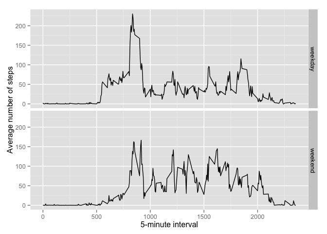

# Reproducible Research: Peer Assessment 1


## Loading and preprocessing the data
1. Load database

```r
# load the activity.csv  database
data<-read.csv("activity.csv")
```
2. Format the date variable

```r
# format date variable
data$date<-as.Date(as.character(data$date),"%Y-%m-%d")
```

## What is mean total number of steps taken per day?

1. Total number of steps taken per day

```r
library(plyr)
# generate a daily steps database removing missing values
daily<-ddply(data,.(date),summarise,dailySteps=sum(steps,na.rm = TRUE))
```
2. Histogram of the total number of steps taken each day

```r
# make a histogram of Sum of daily steps
hist(daily$dailySteps,xlab="Daily steps",main="Sum of daily steps")
```

 

3. Mean and median of the total number of steps taken per day

```r
# report mean and median of daily steps
Summary<-c("Mean"=mean(daily$dailySteps),"Median"=median(daily$dailySteps))
print(Summary)
```

```
##     Mean   Median 
##  9354.23 10395.00
```
## What is the average daily activity pattern?
1. Average steps by interval

```r
# generate average steps by interval database, removing missing values
interv<-ddply(data,.(interval),summarise,meanSteps=mean(steps,na.rm = TRUE))
# plot the data as a trend
plot(interv$interval,interv$meanSteps,type="l", ylab="Average number of steps",
     xlab="5-minute interval")
```

 

2. Interval with the maximun steps

```r
# reporting the interval with the maximun number of steps
interv[which(interv$meanSteps==max(interv$meanSteps)),]
```

```
##     interval meanSteps
## 104      835  206.1698
```

## Imputing missing values
1. Total number of missing values in the dataset

```r
# calculate the NA values
sum(is.na(data$steps))
```

```
## [1] 2304
```
2. Estrategy for data imputation: For the 'steps' missing values we will implemented the average value for the interval
3. New database 'imputed' with no missing data

```r
# imputing data
imputed<-data
for (i in unique(imputed$interval)){
        imputed$steps[which(imputed$interval==i&is.na(imputed$steps))]<-interv$meanSteps[which(interv$interval==i)]
}
```
4. Histogram of the total number of steps taken each day whith imputed data reporting mean and median

```r
# generate a daily steps database removing missing values
dailyImputed<-ddply(imputed,.(date),summarise,dailySteps=sum(steps))
# make a histogram of Sum of daily steps
hist(dailyImputed$dailySteps,xlab="Daily steps",main="Sum of daily steps")
```

 

```r
# report mean and median of daily steps
SummaryImp<-c("Mean"=mean(dailyImputed$dailySteps),"Median"=median(dailyImputed$dailySteps))
print(SummaryImp)
```

```
##     Mean   Median 
## 10766.19 10766.19
```

Imputing missing data generated a normal distribution of the daily steps with the same mean a median

## Are there differences in activity patterns between weekdays and weekends?
1. New factor variable in the dataset with two levels – “weekday” and “weekend”

```r
# create a factor variable for weekday and weekend
imputed$temp<-weekdays(imputed$date) %in% c("Saturday","Sunday")
imputed$day<-factor(imputed$temp,labels=c("weekday","weekend"))
# make a database wit the average steps by interval comparing weekday and weekend 
library(ggplot2)
intervImp<-ddply(imputed,.(day,interval),summarise,meanSteps=mean(steps,na.rm = TRUE))
```
2. Panel plot comparing weekdays with weekend

```r
# make a plot to compare weekday and weekend trend
qplot(interval,meanSteps,data=intervImp,geom="line",facets=day~., ylab="Average number of steps",xlab="5-minute interval")
```

 
